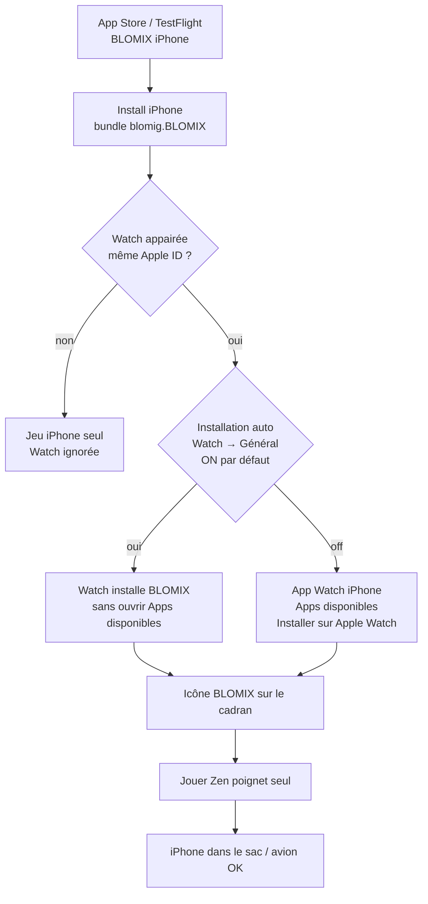
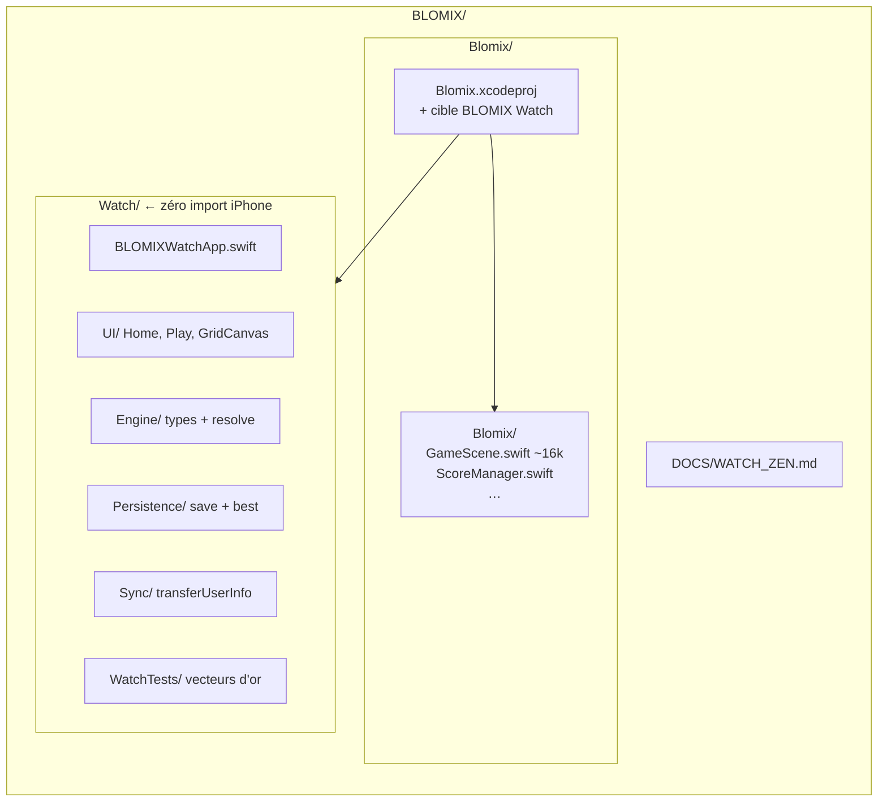
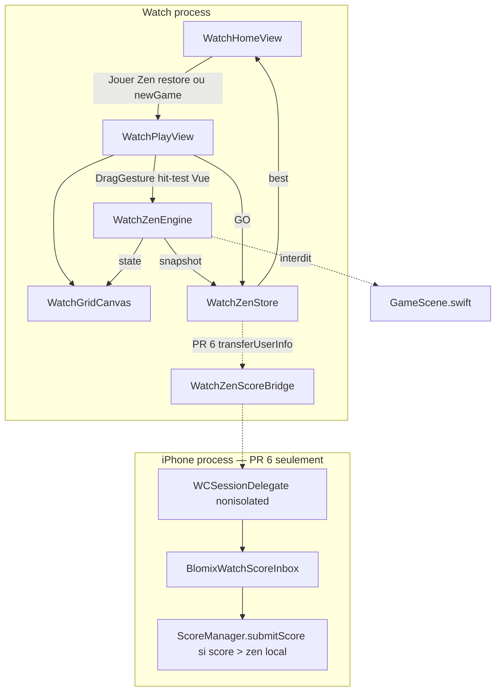
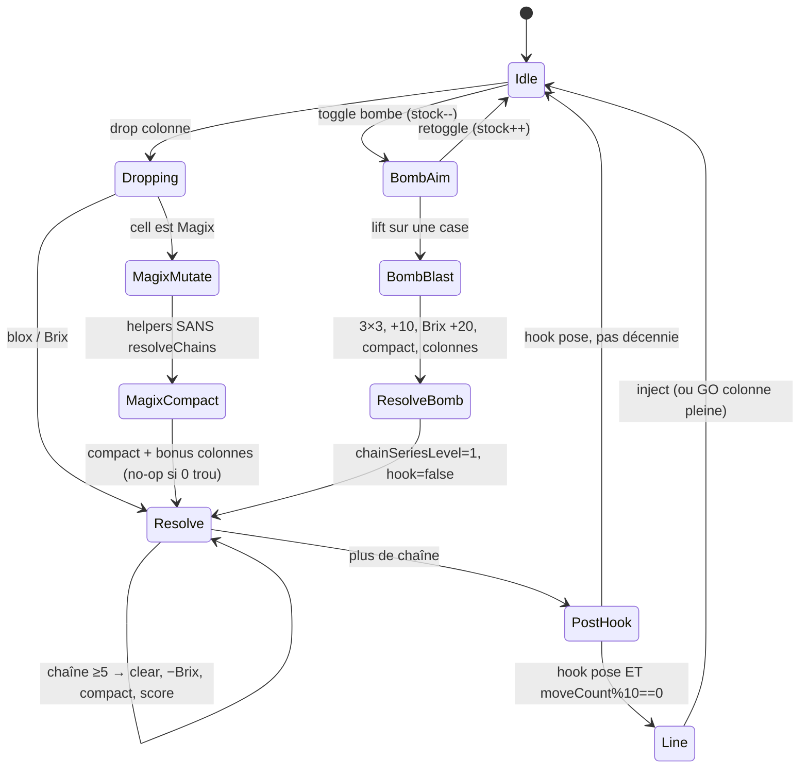
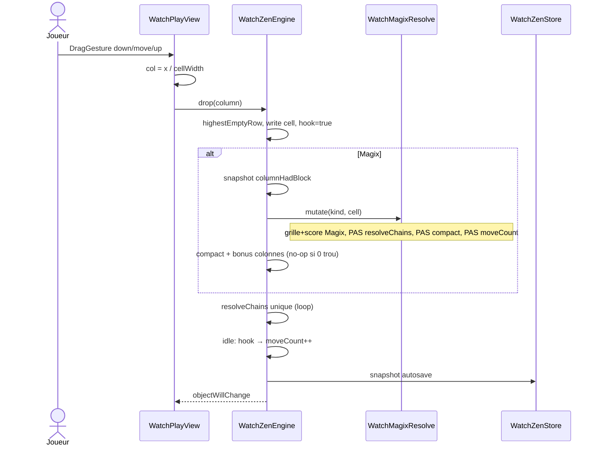

# BLOMIX Apple Watch — Zen light

> **Statut** : révision 6 — Zen Watch jouable + pont scores `transferUserInfo` → board `ZenMode` (7.4 / 139).  
> **Auteur** : —  
> **Date** : 2026-09-27  
> **Cible** : **7.4** (build 139) — compagnon Watch  
> **iPhone de référence** : 7.3 (build 138) **en vente**

Cahier d’implémentation Watch v1. Audience : mainteneur BLOMIX.  
Règles joueur iPhone : [RULES.md](RULES.md). Magix : [MAGIX.md](MAGIX.md). Archi iPhone : [PROJECT_CONTEXT.md](PROJECT_CONTEXT.md). Termes : [GLOSSARY.md](GLOSSARY.md).

---

## Overview

BLOMIX iPhone est un puzzle 8×8 en production (`blomig.BLOMIX`, iOS 18+, Swift 6). Toute la logique vit dans `Blomix/Blomix/GameScene.swift` (~16 200 lignes, SpriteKit + juice). En extraire un module partagé pour la Watch casserait 7.3 et le monolithe.

**Watch v1** est une **app compagnon** watchOS, **cible dédiée**, **zéro fichier Swift partagé** avec l’iPhone. Elle embarque une copie gelée d’un moteur Zen *light* sous `Watch/`. Un seul mode : **Zen** (pas de timer, pas de stages, pas de nuke). Même grille 8×8, gravité inversée, chaînes ≥ 5 en 8-connexité, Brix, Magix (glyphe plat), bombes 3×3 (stock 5), ligne tous les 10 coups. Graphisme : carrés + glyphe, **sans particules, sans halo, sans bounce, sans son**. Compactage : **glissement + fondu** (~0,22 s). Pose = tap de **colonne**, fire-on-release.

L’app Watch **voyage dans l’IPA iOS**. Le joueur installe BLOMIX sur iPhone ; l’install Watch est **automatique** si « Installation automatique des apps » est on, sinon manuelle dans l’app Watch. Il joue Zen poignet seul (iPhone dans le sac, avion). Le record Watch reste local en v1 ; plus tard `WCSession.transferUserInfo` pousse `{score, date, mode: zen}` vers une inbox iPhone qui n’appelle `ScoreManager.submitScore` **que si** le score bat le Zen local.

---

## Background & Motivation

- BLOMIX 7.3 iPhone est **en review** (build 138). Toute extraction / refactor de `GameScene.swift` est hors sujet et risquée.
- Zen iPhone (`isZenMode`, `beginZenModeFromStartScreen()` dans `GameScene.swift`) est déjà le mode « sans chrono » : stock bombe 5, zone 3×3 (`bombCrossArmLength = 0` hors Arcade), scoring ×1, board GC `ZenMode` (`ScoreManager.zenLeaderboardID`).
- Le poignet est le bon endroit pour une partie Zen courte. Arcade (timer, stages, nuke), Défi du jour (CloudKit + graine UTC) et Duel (GKMatch) n’ont pas de place sur 40 mm.
- `GameScene.swift` tire UIKit, SpriteKit, AVFoundation, GameKit, CloudKit, VFX. SpriteKit Watch (`WKInterfaceSKScene` / `SpriteView`) importerait les habitudes juice (60 fps, particules, halos). Ce n’est pas le produit.

Douleur si on « partageait » le moteur :

| Approche | Pourquoi ça casse |
|---|---|
| Extraire `BlockType` / `MagixKind` de `GameScene.swift` | Types **internal** (pas `private`) déjà utilisés par `BlomixRulesGuideViewController`, `BlomixShareComposer`, `BlomixGuideIllustrationView`, `BlomixWhatsNew`. `PriksRules` / `MagixRules` / `GridLayout` **sont** `private`. Extraire = toucher le monolithe ~16 k lignes **pendant** la review 7.3. AGENTS.md « ne pas dupliquer » s’applique à l’**iPhone** |
| Module Swift partagé | Même risque + cible watchOS à faire compiler sans UIKit |
| Porter `GameScene` tel quel | SpriteKit + sons + juice = batterie / RAM Watch, hors spec |

**Décision propriétaire** : dupliquer un moteur light sous `Watch/`. Un drift Magix vs iPhone est **accepté comme resync manuel**, pas comme « v1 approximatif » : la parité grille+score se **prouve** par vecteurs d’or (voir Key Decision 13).

---

## Goals & Non-Goals

### Goals (v1)

- Jouer une partie **Zen complète** sur Apple Watch, **SE 40 mm** comme plancher de layout.
- Même règles Zen iPhone : 8×8, compactage haut, chaînes ≥ 5 8-connexes, Brix, 9 Magix, bombes 3×3 stock 5, ligne / 10 coups, scoring Zen (×1), **y compris** `chainSeriesLevel = 1` après bombe.
- Install **compagnon** : pas d’IPA Watch séparé, pas de fiche App Store Watch-only.
- Jouable **sans iPhone à portée** (règles + save locales).
- Accueil : titre BLOMIX + « Jouer Zen » + meilleur score local.
- Écran de jeu : **maximum de pixels pour la grille**, barre 40 mm **budgétée** (voir layout).
- Batterie : redraw à la demande, pause `scenePhase != .active`, **aucun** audio.
- Cible Xcode **dans** `Blomix/Blomix.xcodeproj`, sources **uniquement** sous `Watch/`.
- Cible de tests Watch (`WatchTests`) pour les vecteurs Magix / `moveCount`.

### Non-goals (v1 et explicitement plus tard)

| Hors v1 | Notes |
|---|---|
| Arcade / stages / timer / nuke | Jamais en Watch v1 |
| Défi du jour | Hub CloudKit, graine UTC — iPhone only |
| Duel / PvP | GKMatch, Elo, attaques |
| Tutoriel, hints, `BlomixMoveAnalyzer` | |
| Digital Crown pour poser | v1 = tap colonne |
| Musique, SFX, `AVAudioSession` | |
| Particules, halo, stretch de lancement, bounce compactage, juice de ligne | |
| Skins iPhone (`color_skins.json` live) | Palette **default** figée ; copie skin via WC **optionnelle plus tard** |
| Submit GameKit **depuis la Watch** | Historiquement fragile ; file iPhone |
| Écriture des slots iPhone `blomix_solo_save_v2` / `blomix_daily_save_v1` | Interdit, y compris plus tard |
| Refactor / partage de `GameScene.swift` | Interdit |
| watchOS 27 comme plancher | Layout 40 mm ; déploiement = génération iOS 18 (watchOS 11+) |
| Fiche App Store Watch indépendante | Compagnon dans l’IPA iOS |

---

## Décisions produit gelées

Ne pas rouvir :

1. **Plus tard**, pas 7.3. Travail **local**, **jamais embed dans le build 138**.
2. **Zen only**.
3. Grille **8×8**, gravité **haut**, chaînes ≥ 5 **8-connexes**, Brix, ligne / 10, bombes stock **5**, **pas de nuke**.
4. **Tous les Magix**, graphisme **simplifié** (carré + glyphe).
5. **Tap colonne**, fire-on-release (down = highlight, up = drop). Pas la Couronne en v1.
6. Plancher **SE 40 mm** (~324×394 canvas natif) **et** 41 / 45 / 49 mm.
7. **Codebase séparée**, **zéro Swift partagé**, copie sous `Watch/`, drift Magix accepté **avec vecteurs d’or**.
8. Couleurs **default** d’abord. **Pas de son**.
9. Accueil : BLOMIX + « Jouer Zen » + best local.
10. Play : max grille. Barre bas G→D : Home rond · Bombe + compteur · file de 3 avec **prochain à poser à DROITE** · score. File **display-only**.

---

## Installation / Xcode / App Store

### Ce que le joueur voit

BLOMIX Watch **n’est pas** une app à sideloader. Elle est **embarquée dans l’IPA iOS** (`blomig.BLOMIX`).



- Chemin **par défaut** : **Installation automatique des apps** (app Watch iPhone → Général). Beaucoup de joueurs n’ouvrent jamais « Apps disponibles ».
- Même **Apple ID** et même compte **Game Center** que l’iPhone appairé (le submit GC, lui, passera par l’iPhone — plus tard).
- Désinstaller BLOMIX iPhone retire le compagnon Watch (comportement Apple compagnon).
- Pas de listing Watch séparé, pas de Watch *only* (`WKWatchOnly = false`).

### Ce que le développeur fait dans Xcode

**Même projet** : `Blomix/Blomix.xcodeproj`. **Pas** de second `.xcodeproj`.

**Branche** : tout embed Watch vit sur une branche **≠** celle du build 138 / review 7.3. Un `archive` du schéma `Blomix` **compile et signe** le Watch dès que Embed Watch Content existe (`fastlane` `archive_release_ipa!` destination `generic/platform=iOS`). Rollback = retirer l’embed ; ne **jamais** le merger dans 138.

1. Xcode 16+ → schéma **Blomix** ouvert.
2. **File → New → Target… → watchOS → App**.
3. Options :
   - Product Name : `BLOMIX Watch` (display `BLOMIX`)
   - Bundle ID : **`blomig.BLOMIX.watchkitapp`** (suffixe compagnon standard)
   - Embed in Application : **Blomix** (cible iOS `blomig.BLOMIX`)
   - Interface : **SwiftUI**
   - Language : Swift
   - Décocher Notification / Complication / Widget si le template les propose (v1 : zéro)
4. **Ne pas** cocher « Watch-only App ».
5. Déplacer / ranger les sources générées sous `Watch/` (voir arborescence). **Aucun** fichier du template ne doit atterrir dans `Blomix/Blomix/` **ni** dans les Compile Sources iOS.
6. Signing : même `DEVELOPMENT_TEAM` que l’iPhone (**`337CZP5VR7`**). **Pas suffisant** : créer l’**App ID** `blomig.BLOMIX.watchkitapp` au Developer Portal + profil de provisioning Watch (Automatic Signing OK en debug ; le premier upload TF échoue souvent tant que l’identifiant n’existe pas). Capabilities Watch v1 : **aucune** (pas Game Center, pas CloudKit, pas Push). Entitlements Watch = fichier **vide** (ne pas copier `Blomix.entitlements`). `WatchConnectivity` n’a pas d’entitlement.
7. `WATCHOS_DEPLOYMENT_TARGET` : **11.0** (paire historique de `IPHONEOS_DEPLOYMENT_TARGET = 18.0`). `SWIFT_VERSION` : **6.0** (comme l’iPhone).
8. Info Watch :
   - `WKCompanionAppBundleIdentifier` = `blomig.BLOMIX`
   - `WKRunsIndependentlyOfCompanionApp` = **YES** (jouer iPhone éteint / avion / sac)
   - `WKWatchOnly` = **NO**
   - `CFBundleDisplayName` = `BLOMIX`
   - `ITSAppUsesNonExemptEncryption` = `false` (comme l’iPhone)
9. Le `pbxproj` iOS gagne un **Embed Watch Content** : un `.app` Watch **dans** le bundle iOS (modèle moderne, **pas** une extension WatchKit / `WatchKit.framework`). C’est le **seul** changement structurel iPhone attendu en PR 1. **`GameScene.swift` ne bouge pas.**
10. Point d’entrée : SwiftUI `@main struct BLOMIXWatchApp: App { WindowGroup { … } }`. `WKApplicationDelegateAdaptor` **seulement** si un delegate Watch devient nécessaire (v1 : non). Pas de classe `WKApplication` comme `@main`.

Archive / TF / App Store : lane existante (`fastlane beta` / `release`) archive la cible iOS ; le Watch app **suit** dans l’IPA. `build_app` signe **deux** bundles. Pas de lane Watch séparée. **Créer l’App ID avant le premier TF.**

#### Checklist pbxproj / archive (PR 1, bloquante)

- [ ] App ID `blomig.BLOMIX.watchkitapp` créé, même team `337CZP5VR7`
- [ ] Entitlements Watch vides
- [ ] `SWIFT_VERSION = 6.0`, `WATCHOS_DEPLOYMENT_TARGET = 11.0`
- [ ] Asset catalog Watch : icônes Home Screen, Notification Center, Short Look, App List (template Xcode)
- [ ] Aucun `.swift` Watch dans les Compile Sources iOS
- [ ] `xcodebuild -scheme Blomix -destination 'generic/platform=iOS' archive` **réussit**
- [ ] L’IPA contient `Watch/*.app` (ou `Watch/BLOMIX Watch.app`)
- [ ] `git diff` : **`GameScene.swift` vide**
- [ ] Branche ≠ review 138

### Indépendance réelle vs listing

| | v1 |
|---|---|
| Lancement Watch sans iPhone joignable | Oui (`WKRunsIndependentlyOfCompanionApp`) |
| Moteur + save | 100 % locaux Watch (`UserDefaults` Watch) |
| Game Center `GKLeaderboard.submitScore` sur Watch | **Non** — ne pas l’appeler |
| Sync record → iPhone | Plus tard, `WCSession.transferUserInfo` (PR 6) |
| Appariement | Watch **compagnon** obligatoire à l’install ; ensuite le jeu ne dépend plus du téléphone |

---

## Hardware & layout (plancher SE 40 mm)

### Modèles 2026 (constat, pas d’invention)

Apple Watch **SE 3** (sept. 2025) reste en **40 mm et 44 mm**. Apple publie pour le 40 mm : **324 × 394 pixels**, 326 ppi, 759 mm² — **identique** au SE 2 40 mm.

watchOS **27** (WWDC 2026) **drop** le SE 2 (et Series 8 / Ultra 1). Le 40 mm **encore supporté par watchOS 27** est le **SE 3**. Series 9 (41/45 mm) reste sur watchOS 27.

BLOMIX iPhone est encore **iOS 18**. Le compagnon historique d’iOS 18 est **watchOS 11**.

**Paire SE 3 ≠ iOS 18.** Apple (sept. 2026) : SE 3 se paire avec **iOS 26+**. Un iPhone resté sur iOS 18 **ne** paire **pas** un SE 3. BLOMIX min iOS 18 **tourne** sur iOS 26 : les joueurs SE 3 ont un téléphone à jour. Le « plancher 40 mm » est un **gabarit de layout**, pas « iOS 18 + SE 3 en même temps ».

| Paramètre | Valeur lockée |
|---|---|
| Plancher **layout** | Classe **40 mm**, canvas natif **324 × 394 px** |
| `WATCHOS_DEPLOYMENT_TARGET` | **11.0** (paire iOS 18). Quand l’iPhone bump iOS 26/27, remonter Watch **en même temps** |
| Appareils visés | SE 2 40/44 (watchOS 11–26, **S8**, **pas d’Always-On**), **SE 3 40/44** (S10, AOD, iOS 26+), Series 9 41/45, Series 10+ 42/46, Ultra 49 |
| Non visés | SE 1 (plus de watchOS récent). Series 8 et plus vieux **si** on exigeait watchOS 27 — on ne l’exige pas |
| Perf floor | **SE 2 / S8** (pas S9/S10) |

**On ne fige pas watchOS 27.** Le 40 mm ne disparaît pas : SE 3 le conserve.

Always-On : **SE 2 n’en a pas** ; **SE 3 oui**. Pause sur `scenePhase != .active` (poignet baissé / app switch) pour **les deux**. Sur SE 3 AOD, l’écran peut rester allumé en luminance réduite : **pas de redraw**, grille figée.

### Canvas vs points SwiftUI

Apple documente **324 × 394 pixels**. `GeometryReader` watchOS 40 mm rapporte ~**162 × 197 pt** (@2x). Les chiffres propriétaire (324 de large, cellule 40,5) sont le **canvas pixel**. L’implémentation travaille en **points SwiftUI**.

| Boîtier | Pixels (Apple) | Points SwiftUI ≈ | Notes |
|---|---|---|---|
| **SE 40 mm** (SE 2 / SE 3) | **324 × 394** | **162 × 197** | **Plancher** |
| SE 44 mm | 368 × 448 | 184 × 224 | |
| Series 9 41 mm | 352 × 430 | 176 × 215 | |
| Series 9 45 mm | 396 × 484 | 198 × 242 | |
| Ultra 49 mm | 410 × 502 | 205 × 251 | |
| Series 10+ 42/46 | 374×446 / 416×496 | plus grand que 40 mm | Pas le plancher |

### Formule et budget 162 × 197 pt (locké)

```
gridSide = min(width, height − bottomBar − topInset)
```

Barre bas : **28 pt** SwiftUI (56 px canvas). **Preview de ligne = overlay in-grid** sur la rangée 7 (bas) : **0 pt** volé à `gridSide`. Jamais de demi-cases *sous* la grille (cette hauteur n’existe pas).

`safeAreaInsets.top` 40 mm (heure) : **typiquement ~19–31 pt**, pas 0–10. **20,25 pt / cellule = meilleur cas** (inset ignoré / heure superposée), **pas** le lock.

**Table 40 mm, points SwiftUI :**

| | Meilleur cas | Pire cas (heure visible) |
|---|---|---|
| Écran | 162 × 197 | 162 × 197 |
| `safeAreaInsets.top` | 0 (ignore + heure overlay) | **31** |
| Barre | 28 | 28 |
| Hauteur restante | 169 | **138** |
| **`gridSide`** | **162** | **138** |
| **Cellule** (sans gouttière) | **20,25** | **17,25** |
| Gouttière optionnelle 1–2 pt | déduite de la cellule | idem → ~16–19 pt |

On **n’ajoute pas** de chrome haut. La pose reste un **bandeau colonne** `cellWidth × gridSide` (pire cas ~17 × 138 pt) : cible verticale toujours énorme. **20,25 pt n’est pas un lock de taille** ; le lock est la **formule** + le budget barre.

### Barre 28 × 162 pt — budget x (locké, échec 40 mm n°1)

Deux slops **44 pt** non chevauchants demandent des centres ≥ 44 pt (88 pt) **avant** file + score : **impossible** sur 162 pt. On **ne** promet **plus** ≥ 44 pt HIG pour Home **et** Bombe.

Disques visuels **22 pt**. Hit rects **exclusifs**, hauteur = barre (28 pt), fire-on-release (lift sur le même bouton) :

| Slot | x SwiftUI (pt) | Largeur | Hit | Notes |
|---|---|---|---|---|
| **Home** | gauche | 32 | 32 × 28 exclusif | Sauve + accueil (plus d’abandon ici) |
| **File P2 P1 P0** | centre | ~54 | **aucune** (display-only) | P0 à **droite** du trio. `#if DEBUG` long-press → cycle Magix P0 |
| **Bombe** | droite | 32 | 32 × 28 exclusif | Comme iPhone ; compteur dans le disque |

**Score** : rangée de l’heure, **en haut à gauche** (`toolbar` leading). L’heure système reste à droite — la grille ne passe plus dessous.

Slops Home/Bombe **ne se chevauchent pas**. Confirm « Nouvelle partie » (accueil, save en cours) : deux boutons **pleine largeur** empilés (≥ 44 pt de haut).

Bombe (visée **case**) : overlay 3×3 sous le doigt, fire-on-release. ±1 case reste dans le 3×3.

### Play screen — 40 mm (schéma, pire cas)

```
┌──────────────────────────── 162 pt ────────────────────────────┐
│ SCORE (+N)                          heure système (droite)     │
│ ░░░ grille (sous le safe area, plus d’overlay heure)        ░ │
│ ░  preview ligne coup 9 = overlay rangée 7, in-grid          ░ │
├────────────────────────────────────────────────────────────────┤
│ Home 32 │     [P2][P1][P0]     │ Bomb 32                       │
│                         barre 28 pt                            │
└────────────────────────────────────────────────────────────────┘
```

File : **display-only**. P0 = **slot de droite du trio**. Ordre G→D : P2 → P1 → **P0**. Bombe à **droite** (comme iPhone). Score **hors** barre bas.

---

## Proposed Design

### Arborescence

Sources Watch **uniquement** sous `Watch/` à la racine du dépôt. Le `.xcodeproj` reste `Blomix/Blomix.xcodeproj`.



```
BLOMIX/
├── Blomix/
│   ├── Blomix.xcodeproj          # + target Watch + WatchTests, Embed Watch Content
│   └── Blomix/                   # iPhone — INTERDIT d’y mettre du code Watch
│       └── GameScene.swift       # ne pas modifier pour Watch
├── Watch/                        # NOUVEAU — cible watchOS
│   ├── BLOMIXWatchApp.swift      # @main App + WindowGroup
│   ├── Info.plist
│   ├── Assets.xcassets           # icônes Watch, pas les WebImages iPhone
│   ├── WatchL10n.swift           # exception AGENTS.md : pas BlomixL10n
│   ├── en.lproj / fr.lproj       # PR 1 ; de/es/it avant ship marketing
│   ├── UI/
│   │   ├── WatchHomeView.swift
│   │   ├── WatchPlayView.swift
│   │   ├── WatchGridCanvas.swift
│   │   └── WatchBottomBar.swift
│   ├── Engine/
│   │   ├── WatchBlockType.swift
│   │   ├── WatchGrid.swift
│   │   ├── WatchZenRules.swift
│   │   ├── WatchZenEngine.swift
│   │   ├── WatchZenRunState.swift   # Codable persisté (sans visée)
│   │   └── WatchMagixResolve.swift  # mute ; compact+resolve = moteur, pas ici
│   ├── Persistence/
│   │   └── WatchZenStore.swift
│   └── Sync/
│       └── WatchZenScoreBridge.swift
├── WatchTests/                   # XCTest watchOS, vecteurs d’or Magix / moveCount
└── DOCS/WATCH_ZEN.md
```

**Règle dure** : aucun `import` Watch → iPhone, aucun fichier dans les deux targets. `AGENTS.md` « ne pas dupliquer `BlockType` » s’applique à l’**iPhone**. Watch est une **exception délibérée**, scoped à `Watch/`.

**l10n Watch** : exception scoped au même titre. Chaînes via `WatchL10n` + `Watch/*.lproj`, **jamais** `BlomixL10n` (zéro Swift partagé), **jamais** de texte UI en dur. FR+EN dès PR 1 ; **DE/ES/IT avant** la version marketing qui ship le compagnon. CTA accueil **« Jouer Zen »** (distinct de iPhone `start.zen` = « Zen »).

### Stack UI

| Couche | Choix | Pourquoi |
|---|---|---|
| Chrome (accueil, barre, GO) | **SwiftUI** | Natif watchOS, pas d’UIKit |
| Grille | **SwiftUI `Canvas`** + `Path` / rects | 64 carrés, 1 draw ; pas de runloop SpriteKit |
| Input grille | `DragGesture(minimumDistance: 0)` | Pas de `UITouch` watchOS |
| Moteur | Swift 6 pur, types `Watch/` | Testable sans WK (`WatchTests`) |
| Interdit | UIKit, SpriteKit, `WKInterfaceSKScene`, `SpriteView`, AVFoundation, `CADisplayLink` | Juice, 60 fps, RAM |

SpriteKit Watch compilerait. On le **refuse** : `GameScene` a trop d’habitudes (shaders Magix, orbit particles, stretch, bounce). Un Canvas ne peut pas « accidentellement » spawner un `SKEmitterNode`.

### Architecture runtime



### Accueil

Écran unique, fond sombre (chrome iPhone Sombre, `#000` / texte clair — pas de toggle Clair en v1).

1. Wordmark **BLOMIX** : **SF Rounded bold** par défaut (0 TTF). Si décevant sur 40 mm : copier `ChangaOne-Regular.ttf` (Regular, pas Italic — iOS `Info.plist` liste Italic ; Regular est enregistré à la main dans `GameViewController.swift` ~114–117). Ne pas lier les TTF iPhone par membership de target.
2. Bouton **« Jouer Zen »**, ou **« Continuer »** s’il y a une save. **« Nouvelle partie »** en secondaire (confirm abandon).
3. Sous le bouton : **meilleur score local** Watch (`0` si aucune partie).

**Owner unique de la reprise** : Home lit `WatchZenStore.hasMidRun`. Continuer → `restore(snapshot)` ; Jouer Zen / Nouvelle partie → `newGame()`. Game Over → accueil (save run **clear**, best éventuellement mis à jour). **Home en partie → save + accueil** (visée droppée, pas d’abandon).

### Écran de jeu

- Grille = `gridSide` ci-dessus. Pas de titre en jeu.
- **Pas** de timer, **pas** de texte LIGNE x/10. Preview coup 9 = **overlay in-grid** rangée 7, plat.
- Barre 28 pt, slots x lockés plus haut.
- Bombe : voir machine à états (stock « dans la main »).

Game Over : voile + score + « Nouveau record » si best Watch battu + tap → accueil. Pas de share, pas de classement, pas de pire coup.

### Input (SwiftUI, pas UIKit)

**Hit-test dans la Vue, pas dans le moteur.** `WatchGridCanvas` / `WatchPlayView` convertit la location :

- Pose : `col = clamp(Int(x / (gridSide/8)), 0, 7)` — bandeau colonne.
- Mode bombe : `row/col` depuis `(x, y)` dans la grille.
- Home / Bombe : boutons SwiftUI, `contentShape(Rectangle())` = hit rects exclusifs 32×28.

Geste grille : **`DragGesture(minimumDistance: 0)`** (équivalent fire-on-release iPhone `beginGhostTracking` / `dropBlock` sur `touchesEnded`, `GameScene.swift` ~14605–14707 — le `touchesBegan` utile commence ~14587).

| Geste | Down | Move | Up | Cancel / value hors grille |
|---|---|---|---|---|
| Pose | `highlightedColumn = col` | MAJ colonne | `drop(column:)` | `cancelGesture()`, pas de pose |
| Colonne pleine, d’autres libres | highlight | | refus, pas de pose | |
| Toutes colonnes pleines | | | Game Over | |
| Mode bombe | overlay 3×3 `aimedBombCell` | suit le doigt | `placeBombAtCell` | `aimedBombCell = nil` |
| Home / bombe HUD | press visuel | sortie du rect exclusif → cancel | fire-on-release | |

Pas de ghost 120 ms. Highlight colonne = 1 `@Published`, redraw **piloté par le geste** (pas de `CADisplayLink` / `Timer` 30 Hz sauf preuve que le geste ne suffit pas).

`isProcessing` : ignorer les taps pendant resolve.

### Moteur light (copie, pas module)

Snapshot sémantique : **fonctions 7.3** listées ci-dessous, **pas** les commentaires périmés de `MagixKind` (ex. TWISTX commenté « interactif » ~561 ; l’implémentation `applyMagixEffect_twistx` ~9353 est **déjà auto**). Drift ultérieur = resync **manuel** + **rejeu des vecteurs d’or**.

Constantes à recopier (`WatchGridLayout`, `WatchPriksRules`, `WatchMagixRules`) :

| Source iPhone | Valeur |
|---|---|
| `GridLayout.rowCount / columnCount` | 8 / 8 |
| `topRowIndex` / `bottomRowIndex` | 0 / 7 |
| `PriksRules.spawnProbability` | 1/8 |
| `PriksRules.initialHitsRemaining` | 5 |
| `MagixRules.spawnProbabilityByKind` | twistx 1/324, colorx 1/180, scrumblx 1/180, crosx 1/432, slashx 1/432, chromax 1/324, brixed 1/324, cleanx 1/500, bombx 1/500 |
| `chromaxPathLength` | 15 |
| `brixedInitialHits` | **9**. Wipe des **autres** Brix (+20 chacun). **Pas** de −2. `MagixRules.brixedGlobalDecrement` est une **constante morte** (déclarée ~741, jamais lue). `finishBrixedDecrement` ~9600 **vide** les autres Brix |
| Stock bombe Zen | 5 |
| Zone bombe Zen | 3×3 uniquement (`bombCrossArmLength = 0`) |
| Ligne | `moveCount % 10 == 0` dans le **seul** `resolveChains` si hook pose ; bombe ≠ coup |
| Preview ligne | `moveCount % 10 == 9` |
| Ligne : strip Magix → couleur | comme `nextBottomLineRowForSession` |

Types (copie `Codable`) :

```swift
enum WatchMagixKind: String, Codable, CaseIterable {
    case chromax, brixed, crosx, slashx, scrumblx, colorx, cleanx, twistx, bombx
}

enum WatchBlockType: Equatable, Codable {
    case empty
    case color(String)   // red blue green yellow purple orange
    case priks(Int)
    case magix(WatchMagixKind)
}
```

Glyphes = `MagixRules.symbol(for:)` : `? 9 + X = O ∞ § B`.

### Machine à états pose / Magix / bombe / ligne (lockée)

Sur iPhone, `dropBlock` pose `shouldRunPostPlacementHooks = true` **une fois** (~8411) puis Magix (`applyMagixEffect_*`) **rappelle** `resolveChains()`, et c’est **cet** appel qui fait `moveCount++` / ligne (~5897–5948). Recopier ce schéma **et** incrémenter dans le pipeline externe = **double compte** (ligne / 10 dérive). Watch est synchrone : on **simplifie** sans changer le résultat.



**Règles :**

1. **Pose** (`drop`) : snapshot `columnHadBlock` **avant** toute mutation, écrit la case, `shouldRunPostPlacementHooks = true`, `chainSeriesLevel = 0`. Si Magix → `WatchMagixResolve.mutate(...)` **uniquement** (grille + score immédiat Magix : wipe Brix, +200 SAINTX, +1 BOMBX). Les helpers **n’appellent pas** `resolveChains`, **n’appellent pas** compact, et **n’incrémentent pas** `moveCount`.
2. **Après Magix `mutate` (toujours)** : `compactGridTowardTop()` + `awardFullyClearedColumnBonuses` (et bonus 500 si grille vide) — équivalent Watch de `applyMagixCompactionAndContinue` ~10348 **sans juice**. Peinture (CHROMAX / CROSSX / SLASHX / BOMBX / TWISTX) : compact = **no-op** s’il n’y a pas de trous. Wipes (COLORX / SAINTX / BRIXED / SCRUMBLX) : les trous **doivent** remonter avant le flood, sinon `highestEmptyRow` pose dans un trou et les chaînes post-gravité sont manquées. iPhone `resolveChains` **ne compacte pas** s’il n’y a pas de groupe gagnant (~5893–5899) : ce n’est **pas** un substitut.
3. **Un seul** `resolveChains()` ensuite : boucle flood ≥ 5, −1 Brix adj, compact haut **dans** la boucle de vagues, bonus colonnes / grille vide des **clears**. Quand plus de chaîne : si `shouldRunPostPlacementHooks` → `false`, `moveCount += 1`, refresh preview, si `moveCount > 0 && moveCount % 10 == 0` → injecter ligne (Magix strippés).
4. **Bombe** : `shouldRunPostPlacementHooks` reste **false**. Blast 3×3 → +10 → Brix zone +20 → compact → bonus colonnes → **`chainSeriesLevel = 1`** → `resolveChains()` (même ordre compact-puis-resolve que Magix ; RULES.md §5, iPhone ~11209–11211). **Pas** de `moveCount++`.
5. Game Over pose / ligne : inchangé vs iPhone.



Fonctions iPhone à **reproduire** (pas appeler) :

| iPhone | Watch |
|---|---|
| `highestEmptyRow(inColumn:)` | identique |
| `compactGridTowardTop()` | identique |
| `resolveChains` sémantique | **un** owner de `moveCount` / ligne |
| `randomNextPlayableBlock()` | Magix cumulé puis Brix 1/8 puis couleur |
| `dropBlock(usingColumn:)` | sans sprite ; pose le hook |
| `placeBombAtCell` / `bombAffectedCells` | 3×3 ; `chainSeriesLevel = 1` ; hook false |
| `toggleBombMode()` ~10607 | enter : `bombCount--` si `> 0` ; cancel : `bombCount++` ; **`bombCount` peut valoir 0 pendant `isBombMode`** (bombe dans la main, ~10461, ~11000) |
| `addRandomLinePushingGridUp()` | Magix strippés |
| `applyMagixEffect_*` **corps grille+score** | `WatchMagixResolve.mutate` sans juice, sans compact, sans `resolveChains` |
| `applyMagixCompactionAndContinue` ~10348 | **Après tout Magix `mutate`** : compact haut + bonus colonnes / 500, **puis** le `resolveChains` unique. Paint = no-op compact si 0 trou |
| `applyMagixAxisPaint` | occupancy CROSSX/SLASHX |
| `chainClearScorePoints` | 5/7/10/13/15/20 + `+10 × chainSeriesLevel` |
| `fullyClearedBoardBonusPoints = 500` | plat (Zen) |
| SAINTX +200 | plat ; Brix `max(1, N)` |
| Brix 0 / wipe / bombe | +20 |
| Bombe utilisée | +10 |
| Colonne vidée | +10 |

Game Over pose : colonne visée pleine **et** aucune autre jouable. Game Over ligne : une colonne déjà pleine à l’injection.

### Magix light (9/9) — occupancy 7.3

Référence = **fonctions**, snapshot 7.3 :

| Kind | Fonction iPhone | Notes commentaire |
|---|---|---|
| chromax | `applyMagixEffect_chromax` ~9455 | marche occupée 8-connexe |
| brixed | `applyMagixEffect_brixed` ~9545 + `finishBrixedDecrement` ~9600 | wipe, pas −2 |
| crosx | `applyMagixEffect_crosx` ~9644 + `applyMagixAxisPaint` ~9682 | skip empty |
| slashx | `applyMagixEffect_slashx` ~9665 + axis paint | skip empty |
| scrumblx | `applyMagixEffect_scrumblx` ~10011 / `_shiftGrid` ~10316 | |
| colorx | `applyMagixEffect_colorx` ~8971 | Watch : skip roulette |
| cleanx | `applyMagixEffect_cleanx` ~9181 | `priks(max(1, clearedCount))` |
| twistx | `applyMagixEffect_twistx` ~9353 | **auto** (commentaire MagixKind « interactif » **périmé**) |
| bombx | `applyMagixEffect_bombx` ~9762 | **rangs 0…3**, pas « 3 couches » |

Après `mutate` : **toujours** compact + bonus colonnes (no-op paint si 0 trou), **puis** le **seul** `resolveChains` (hook déjà true). Les lignes « → chaînes » ci-dessous = **effet visé après gravité**, pas un second appel.

| Kind | Glyphe | Occupancy / mutation Watch |
|---|---|---|
| `.chromax` | ? | Marche 8-connexe depuis l’atterrissage, **cases `!= .empty` uniquement**, ≤ 15 (landing inclus) → une couleur palette |
| `.brixed` | 9 | Landing → `priks(9)`. **Détruit** tous les **autres** Brix (`= .empty`, +20 chacun). **Aucun** −2 |
| `.crosx` | + | Ensemble = ligne + colonne d’atterrissage, **seulement `.color` et `.priks`** (`.empty` / `.magix` **sautés**). Landing Magix **ajouté** à l’ensemble (comme `applyMagixAxisPaint`). Une couleur palette |
| `.slashx` | X | Les deux diagonales, **même prédicat** `.color`/`.priks`, landing ajouté. Une couleur |
| `.scrumblx` | = | Chaque ligne occupée : décalage 1–7 wrap ; −1 **tous** les Brix (0 → disparition +20) |
| `.colorx` | O | Landing COLORX → `.empty`. Pool = couleurs **présentes**, sinon palette. Tire **immédiatement** (pas de roulette ~9010–9023). Efface tous les `.color` de cette couleur ; score = `chainClearScorePoints` pour le count (vague 0) |
| `.cleanx` | ∞ | Cibles = occupées **hors** case CLEANX. `clearedCount = targets.count`. Vide les cibles. Landing → `priks(max(1, clearedCount))`. **+200** |
| `.twistx` | § | **Auto** : une couleur **présente** ↔ tous les Brix (valeur = min des Brix, défaut 3) |
| `.bombx` | B | **Cases occupées uniquement**, 4 rangs : **0** = landing ; **1** = voisins 8-connexes occupés ; **2** = 1 voisin occupé aléatoire **par** case du rang 1 ; **3** = 1 voisin occupé aléatoire **par** case du rang 2. Peint en une couleur. **+1 bombe garanti** (`grantBombxStockBonus` / `bombCount += 1` ~9942), même 0 clear |

COLORX / TWISTX : zéro animation.

Rendu Magix : fill priks `#00024c` + glyphe `#ead400`. Blox : palette **default** `color_skins.json` :

| Clé | Hex |
|---|---|
| blue | `#00b3e9` |
| red | `#f2009f` |
| purple | `#fda1ff` |
| yellow | `#ffb200` |
| green | `#008e34` |
| orange | `#00688b` |
| priks | `#00024c` |
| prikstext | `#ead400` |

Hex en constantes Watch, pas tout le JSON.

### Vecteurs d’or Magix (`WatchTests`)

« Drift accepté » ≠ v1 faux. Cible **`WatchTests`** (XCTest watchOS, moteur pur, 0 WK UI).

Pour **chaque** `WatchMagixKind` (et 1 vecteur bombe + 1 vecteur ligne / 10) : JSON `{ grid, p0, moveCount, bombCount, score, chainSeriesLevel }` **avant** / **après** le coup, copié d’une session 7.3 (debug iPhone ou relecture des `applyMagixEffect_*`). Assert grille, score, `bombCount`, **`moveCount`** (Magix pose = **+1 une fois**, jamais +2).

**Vecteur compact obligatoire (PR 3b)** : wipe BRIXED ou COLORX dont une chaîne ≥ 5 **n’existe qu’après** `compactGridTowardTop` (ex. deux groupes de 3 séparés par un Brix détruit). Assert : plus aucun trou sous un blox (`highestEmptyRow` cohérent), la chaîne a scoré, `moveCount += 1` **une** fois. Sans ce vecteur, un `mutate → resolveChains` naïf passe les tests paint et casse la gravité.

`#if DEBUG` : **long-press sur la file** (zone 64–118) cycle le kind de P0. Point d’entrée unique pour QA 40 mm. Pas de Couronne.

### Graphisme — interdit

Pas de : particules, halo, stretch, bounce / sparkles, juice de ligne, respiration preview, shaders, `SKAction`, TimelineView décoratif, haptic en boucle. Compactage Watch : slide + fade 0,22 s (IDs stables). **Haptic** : aucun chrome / drop ; click chaîne plus tard. Redraw geste / post-resolve seulement.

### Batterie / perf

| Poste | Budget |
|---|---|
| Grille 64 rects Canvas | visée ≪ 1 ms / frame sur **S8 (SE 2)**, le plancher |
| Resolve synchrone 8×8 | négligeable |
| FPS | 0 idle ; 1 frame post-coup ; highlight = frames du `DragGesture` |
| RAM | moteur + 1 surface ; viser ≪ 15 Mo |
| Radio | v1 = 0 ; PR 6 = `transferUserInfo` au GO |
| AOD | SE 3 : luminance réduite, **0 fps** ; SE 2 : écran off |

---

## API / Interface Changes

### Watch (nouveau)

Le store sérialise **`WatchZenRunState`** (valeur `Codable`) — **sans visée**. Un tuple `(row, col)` **n’est pas** `Codable` ; ne pas le coller sur l’état persisté.

```swift
struct WatchGridAddress: Hashable, Equatable {
    var row: Int
    var col: Int
}

struct WatchZenRunState: Codable, Equatable {
    var version: Int                 // 1
    var grid: [[WatchBlockType]]
    var p0, p1, p2: WatchBlockType
    var moveCount: Int
    var nextBottomLine: [WatchBlockType]
    var bombCount: Int
    var isBombMode: Bool             // stock dans la main ; visée elle-même non persistée
    var score: Int
    var chainSeriesLevel: Int
    var chainClearWaveCount: Int
    var savedAt: Date
}

@MainActor
final class WatchZenEngine: ObservableObject {
    @Published private(set) var run: WatchZenRunState
    @Published private(set) var aimedBombCell: WatchGridAddress?   // UI only, pas Codable
    @Published private(set) var highlightedColumn: Int?
    @Published private(set) var isGameOver: Bool
    @Published private(set) var incomingPreview: [WatchBlockType]?

    var grid: [[WatchBlockType]] { run.grid }
    var moveCount: Int { run.moveCount }
    var chainSeriesLevel: Int { run.chainSeriesLevel }
    var bombCount: Int { run.bombCount }
    var isBombMode: Bool { run.isBombMode }

    func drop(column: Int)
    func setHighlightedColumn(_ col: Int?)
    func cancelGesture()
    func toggleBombMode()            // -- à l’entrée, ++ à l’annulation ; aimedBombCell = nil
    func updateBombAim(_ cell: WatchGridAddress)
    func placeBombAtAimedCell()
    func newGame()
    func restore(_ run: WatchZenRunState)          // aimedBombCell := nil
    func exportRunState() -> WatchZenRunState      // n’inclut pas la visée
}
```

**Hit-test = Vue.** Le moteur reçoit des indices déjà calculés (`drop(column:)`, `updateBombAim(_:)`), pas des `CGPoint`.

Home : `hasMidRun` → `restore` sinon `newGame`. Pas de `restoreIfNeeded` magique dans le moteur.

Bombe dans la main : `isBombMode == true` et `bombCount == 0` est **légal** jusqu’au blast ou cancel.

API iPhone = inbox scores Zen uniquement (`BlomixWatchScoreInbox`). Pas de save iPhone, pas de `GameScene`.

### iPhone — PR 6 seulement

Fichier **nouveau** `Blomix/Blomix/BlomixWatchScoreInbox.swift` (**pas** `GameScene`) :

- Activer `WCSession.default` depuis `SceneDelegate` / `AppDelegate` (aujourd’hui : auth GC seulement). **Pas** depuis `GameScene`.
- `WCSessionDelegate` **n’est pas** `@MainActor`. Copier le pattern GameKit : `@preconcurrency import WatchConnectivity`, méthodes `nonisolated`, hop `Task { @MainActor in … }` **avant** `ScoreManager` (`@MainActor`).
- Transport **primaire Watch → iPhone** : **`transferUserInfo`** (file système, survit iPhone tué / sac). `updateApplicationContext` acceptable en complément *latest-only* (on n’envoie que des PB). **`sendMessage` optionnel** si `reachable` (latence) — **pas** le chemin de durabilité. **Pas** de FIFO maison + `reachable`.
- Clés `userInfo` gelées : `schema` (Int 1), `mode` (`"zen"`), `score` (Int), `date` (ISO-8601 String).
- Inbox :

```swift
guard mode == "zen", score > ScoreManager.shared.getLocalZenHighScore() else { return }
ScoreManager.shared.submitScore(score, leaderboardID: ScoreManager.zenLeaderboardID)
```

`submitScore` (~482–521) appelle **toujours** `GKLeaderboard.submitScore`, même si `updateLocalZenHighScoreIfBetter` no-op. Un Watch 1200 après un iPhone 8000 est localement `max`-safe mais **ne doit pas** partir vers GC au cas où le board ne serait pas strictement Best Score. D’où le `guard`.

- **Ne pas** `recordGameScore` (moyenne Arcade).
- **Ne pas** lire/écrire `blomix_solo_save_v2` / `blomix_daily_save_v1`.

`GameScene.swift` : **zéro diff**, y compris PR 6.

---

## Data Model Changes

### Trois slots, trois processus

| Slot | Clé | Process | Contenu |
|---|---|---|---|
| Arcade / Zen iPhone | `blomix_solo_save_v2` (`BlomixSoloGameSave` v7) | iPhone | Grille + file + `isZenMode` + stages… |
| Défi du jour | `blomix_daily_save_v1` | iPhone | Run daily |
| **Watch Zen** | `blomix_watch_zen_save_v1` + `blomix_watch_zen_best_v1` | **Watch** | `WatchZenRunState` + best **Watch** |

Watch **ne clobber jamais** les deux slots iPhone. Pont = **scores Zen**, pas une grille.

### Save run Watch (v1)

JSON = `WatchZenRunState` (champs API ci-dessus — **pas** `aimedBombCell`). Flush : après coup stable, `scenePhase` background / inactive, Home. Visée **toujours** droppée (`aimedBombCell = nil`) au restore / flush / `toggleBombMode` cancel : ce n’est pas un champ disque. Grille déjà compactée (moteur synchrone).

**Stub PR 5a** : sérialiser *tout* le snapshot courant dès que le moteur existe (PR 2) — pas besoin d’attendre Magix/bombes. Champs encore à 0 restent valides.

Best : `blomix_watch_zen_best_v1`, `max` monotone. Accueil = cette clé (v1 : pas de pull GC).

### File WCSession (PR 6)

```json
{ "schema": 1, "mode": "zen", "score": 1240, "date": "2026-09-26T12:00:00Z" }
```

Watch au GO si `score >` best Watch (coalesce **max**, une entrée pending). `transferUserInfo` ; pas de FIFO applicative. iPhone : `guard score > getLocalZenHighScore()`. Pas de merge de parties en cours.

---

## Alternatives Considered

### A. Extraire un module Swift partagé depuis `GameScene.swift`

- **+** Une seule source de vérité Magix.  
- **−** `BlockType` / `MagixKind` **internal** déjà multi-fichiers iOS ; règles `private` ; review 7.3.  
- **Verdict** : rejeté. Copie `Watch/` + vecteurs d’or.

### B. SpriteKit Watch (`SpriteView` / `WKInterfaceSKScene`)

- **+** Recoller des bouts visuels iPhone.  
- **−** 60 fps, tentation juice.  
- **Verdict** : rejeté. Canvas + `DragGesture`.

### C. App Watch indépendante (fiche App Store séparée)

- **+** Install sans iPhone.  
- **−** Double review, GK Watch.  
- **Verdict** : rejeté. Compagnon + `WKRunsIndependentlyOfCompanionApp`.

### D. Digital Crown = choix de colonne

- **+** Précision 40 mm.  
- **−** Hors gel v1. Piste v2.

### E. App Group + UserDefaults partagés

- **+** Best unique.  
- **−** Clobber saves iPhone.  
- **Verdict** : `transferUserInfo` explicite (PR 6).

### F. `sendMessage` + FIFO locale si `!reachable`

- **−** Perd les scores si iPhone tué / sac (le cas Zen).  
- **Verdict** : `transferUserInfo` (file système).

---

## Security & Privacy

| Sujet | Traitement |
|---|---|
| Auth | Aucune sur Watch v1. GC = iPhone, même Apple ID |
| Données | Score + grille locale, pas de PII, pas de CloudKit Watch |
| WCSession PR 6 | `transferUserInfo` score/date/mode ; pas de grille |
| Réseau Watch | v1 : aucun |
| Entitlements Watch | **Vides**. Ne pas copier `Blomix.entitlements` |
| Chiffrement | `ITSAppUsesNonExemptEncryption = false` |

Menace : pont qui `clear()` `blomix_solo_save_v2`. Mitigation : inbox **scores Zen si meilleurs**, zéro save iPhone.

---

## Observability

`Logger(subsystem: "blomig.BLOMIX.watchkitapp")` :

| Event | Niveau |
|---|---|
| `drop col= n score= moveCount=` | debug |
| `game_over score= best=` | info |
| `save_ok` / `save_fail` | info / error |
| PR 6 : `transferUserInfo_enqueued` / `iphone_applied` / `iphone_skipped_not_better` | info |

Batterie : test SE 2 (pas AOD) **et** SE 3 (AOD), 10 min, poignet baissé.

QA Magix : vecteurs `WatchTests` + long-press DEBUG file sur 40 mm.

---

## Rollout Plan

| Phase | Quoi |
|---|---|
| 0 | Spec. **Local. Branche ≠ 138.** |
| 1–5 | PRs Watch sur cette branche. `xcodebuild` iOS archive doit rester vert **sur la branche Watch** ; **aucun embed** sur 138 |
| 6 | `transferUserInfo`, hors review 7.3 |
| Marketing | **Nouvelle** `MARKETING_VERSION` : CHANGELOG + `store/whats-new/` 5 langues + screenshots Watch. **Pas** 7.3. l10n DE/ES/IT Watch |
| Rollback | Retirer Embed Watch Content du `pbxproj` |
| 7.3 | **Aucun** fichier Watch dans l’archive review |

Risque IPA : quelques Mo. Premier TF : App ID Watch doit exister.

---

## Risques

| # | Risque | Sévérité | Mitigation |
|---|---|---|---|
| R1 | Cellule ~17–20 pt | **Haute** | Cible = **colonne** ; fire-on-release |
| R1b | Barre 162 pt, slop 44 impossible | **Haute** | Hit 32×28 exclusifs Home/Bombe ; fire-on-release |
| R2 | Visée bombe au cell | Moyenne | Overlay 3×3 |
| R3 | Drift Magix | Moyenne | Vecteurs d’or + fonctions 7.3, pas commentaires |
| R3b | Double `moveCount` Magix | **Haute** | Helpers sans `resolveChains` ; un hook |
| R4 | Toucher `GameScene.swift` | **Haute** | Diff iPhone = pbxproj + inbox PR 6 |
| R5 | Submit GK Watch | Moyenne | Pas de capability GC |
| R6 | Clobber save iPhone | **Haute** | Clés Watch ; inbox si meilleur |
| R7 | Batterie / AOD | Moyenne | Pause `scenePhase` ; SE 2 sans AOD |
| R8 | Template dans Compile Sources iOS | Moyenne | Checklist PR 1 |
| R9 | SE 2 droppé watchOS 27 | Basse | SE 3 40 mm = 324×394 |
| R10 | Review 7.3 polluée | **Haute** | **Branche ≠ 138** ; pas d’embed dans 138 |
| R11 | Premier TF signing Watch | **Haute** | App ID + profil avant archive |
| R12 | `sendMessage` perd les scores | Moyenne | `transferUserInfo` |

---

## Key Decisions

1. **Compagnon dans l’IPA iOS**, bundle `blomig.BLOMIX.watchkitapp`, pas de sideload. Install auto (Réglages Watch) par défaut, sinon Apps disponibles.

2. **`WKRunsIndependentlyOfCompanionApp = YES`**, règles + save 100 % Watch.

3. **Submit GC seulement via iPhone** (`ScoreManager`, board `ZenMode`). Transport PR 6 = **`WCSession.transferUserInfo`** ; inbox **`submitScore` ssi `score > getLocalZenHighScore()`**. Pas de GameKit Watch. Delegate `nonisolated` + hop MainActor.

4. **Zéro Swift partagé** avec `GameScene.swift`. `BlockType` / `MagixKind` sont **internal** (déjà multi-fichiers iOS) ; `PriksRules` / `MagixRules` / `GridLayout` sont `private`. Extraire toucherait le monolithe en review → copie `Watch/` = exception AGENTS.md.

5. **SwiftUI Canvas** + `DragGesture(minimumDistance: 0)`. Hit-test **dans la Vue**. Pas SpriteKit, pas `CADisplayLink`.

6. **Plancher layout = 324×394 px (40 mm)**, watchOS **11**, perf **S8 / SE 2**. 20,25 pt/cellule = **meilleur cas**. SE 3 paire iOS 26+ ; BLOMIX iOS 18 tourne sur iOS 26.

7. **Cible de pose = colonne**. Barre : hit **32×28 exclusifs** Home/Bombe (44 pt × 2 est impossible sur 162 pt). Preview ligne **in-grid**.

8. **P0 à droite** dans la file.

9. **Palette default figée**.

10. **Troisième slot de save** (`WatchZenRunState`, sans visée). Interdiction d’écrire les slots iPhone. Autosave **dès PR 2** (stub).

11. **Pas de son, pas de juice.**

12. **Travail local, branche ≠ build 138.**

13. **Parité Magix = fonctions 7.3 + vecteurs d’or `WatchTests`** (grille, score, `bombCount`, `moveCount`, **pas de trous**). Commentaires `MagixKind` ignorés. Helpers Magix **ne** rappellent **pas** `resolveChains`. Après `mutate` : **toujours** `applyMagixCompactionAndContinue` light (compact + bonus colonnes) **puis** le `resolveChains` unique. Vecteur wipe qui ne chaîne qu’après gravité.

14. **Bombe : `chainSeriesLevel = 1`, hook pose = false.** Stock : `--` à l’armement, `++` à l’annulation ; `bombCount == 0 && isBombMode` légal.

---

## PR Plan

Phases **locales** sur une **branche qui n’embarque jamais dans 138**. Pas Graphite. Schéma Blomix iPhone compilable **sur cette branche** (SDK iOS, pas besoin de Watch sim pour *compiler* ; l’**archive** signe le Watch).

Ordre : **1 → 2 → 5a stub save → 4 bombes → 3a paint Magix → 3b rewrite Magix → 5b polish save → (6)**.

PR 2 **inclut déjà** `moveCount` + ligne / 10 (sans Magix dans la file : spawn Magix désactivé). Ainsi PR 3 réutilise le hook (Issue 1) au lieu de l’inventer trop tard. BOMBX `+1` arrive en 3a.

### PR 1 — Cible Watch vide + accueil

- **Titre** : `feat: cible watchOS compagnon + accueil Zen`
- **Dépendances** : aucune (branche ≠ 138)
- **Fichiers** : `Blomix/Blomix.xcodeproj` ; `Watch/BLOMIXWatchApp.swift` (`App` + `WindowGroup`) ; `Watch/UI/WatchHomeView.swift` ; `Watch/WatchL10n.swift` ; `Watch/{en,fr}.lproj` ; Info.plist ; Assets icônes Watch ; entitlements vides
- **Description** : checklist Installation (App ID, Swift 6, archive iOS contient `Watch/*.app`, `GameScene` diff vide). Accueil wordmark SF Rounded + « Jouer Zen » + best 0.

### PR 2 — Grille 8×8 tap + **ligne / 10** (sans Magix, sans bombe)

- **Titre** : `feat: grille Watch 8×8 tap colonne + décennie`
- **Dépendances** : PR 1
- **Fichiers** : Engine (drop, compact, chaînes, scoring, `shouldRunPostPlacementHooks`, `moveCount`, injection, preview in-grid) ; Play/Canvas/BottomBar (file + score ; bombe disabled) ; `WatchTests` smoke drop + `moveCount % 10`
- **Description** : spawn couleur + Brix 1/8 **uniquement**. `DragGesture`. Layout formule + barre 32/32/54/44. GO → accueil.

### PR 5a — Stub save + best (wrist-down)

- **Titre** : `feat: autosave Watch Zen stub`
- **Dépendances** : PR 2
- **Fichiers** : `WatchZenRunState` + `WatchZenStore` ; `scenePhase` ; Home `hasMidRun` → restore / newGame
- **Description** : dump `WatchZenRunState` **tel quel**. Ne pas attendre Magix. Clés Watch only. Visée hors JSON.

### PR 4 — Bombes 3×3

- **Titre** : `feat: bombes Watch Zen 3×3`
- **Dépendances** : PR 5a
- **Fichiers** : engine toggle / visée / blast ; barre Bombe ; vecteur test bombe (`chainSeriesLevel = 1`, `moveCount` inchangé)
- **Description** : stock 5, bombe dans la main, +10 / Brix +20, hook false. **BOMBX +1 plus tard (3a).**

### PR 3a — Magix peinture (long pole, 1/2)

- **Titre** : `feat: Magix Watch paint CHROMAX/CROSSX/SLASHX/BOMBX`
- **Dépendances** : PR 4 (hook + bombe HUD déjà là)
- **Fichiers** : `WatchMagixResolve` (4 kinds), spawn fractions, glyphes, `WatchTests` vecteurs + `moveCount == +1`
- **Description** : occupancy skip-empty, BOMBX rangs **0…3**, +1 stock. **Pas** de `resolveChains` dans les helpers. Long-press DEBUG file.

### PR 3b — Magix réécriture (long pole, 2/2)

- **Titre** : `feat: Magix Watch COLORX/SAINTX/TWISTX/BRIXED/SCRUMBLX`
- **Dépendances** : PR 3a
- **Fichiers** : même resolveur + vecteurs (SAINTX `max(1,N)`, BRIXED wipe sans −2, COLORX instantané, TWISTX auto, **wipe qui ne chaîne qu’après compact**)
- **Description** : fin de la parité 9/9. Compact Magix (`applyMagixCompactionAndContinue` light) **avant** le `resolveChains` unique. C’est le gros du port (~sémantique 1,5 k lignes iPhone juice-stripped).

### PR 5b — Save : visée cancel + GO best

- **Titre** : `fix: flush Watch droppe la visée (non persistée)`
- **Dépendances** : PR 3b
- **Fichiers** : store flush ; `aimedBombCell` reste `@Published` hors `WatchZenRunState`
- **Description** : polish. 5a suffit à jouer. La visée n’a jamais été un champ JSON.

### PR 6 — `transferUserInfo` scores Zen (local 7.4)

- **Titre** : `feat: pont Watch → iPhone Zen (transferUserInfo)`
- **Dépendances** : PR 5 + iPhone **hors** 7.3
- **Fichiers Watch** : `WatchZenScoreBridge.swift`
- **Fichiers iPhone** : **nouveau** `BlomixWatchScoreInbox.swift` ; activation `WCSession` dans `SceneDelegate` / `AppDelegate` ; **pas** de changement sémantique `ScoreManager` hors du `guard` inbox
- **Interdit** : `GameScene.swift`, saves iPhone, `recordGameScore`
- **Description** : clés `schema/mode/score/date`. Delegate `nonisolated`. `guard score > getLocalZenHighScore()`. Accueil Watch reste sur best Watch.

---

## Open Questions

Quasi tout est locké. Hors v1 (pas bloqueurs) :

1. **Police wordmark** : **SF Rounded** (gelé).
2. **Haptic** : **aucun** pour le chrome / drop. Un click **sur chaîne** plus tard (quand la grille existe).
3. **Screenshots Watch ASC** : une fois que ça tourne sur montre réelle, pas avant.

Pas de question ouverte sur le 40 mm, l’install compagnon, le tap colonne, le non-partage de `GameScene`, le hook Magix, ou `transferUserInfo`.

---

## References

| Doc / fichier | Usage |
|---|---|
| [RULES.md](RULES.md) | Zen, scoring, ligne, bombes 3×3, combo bombe §5 |
| [MAGIX.md](MAGIX.md) | 9 kinds, glyphes, spawn ; BRIXED plus de −2 |
| [PROJECT_CONTEXT.md](PROJECT_CONTEXT.md) | `BlockType`, `MagixKind`, save v7, Zen, GC |
| [GLOSSARY.md](GLOSSARY.md) | crosx = CROSSX, cleanx = SAINTX |
| [VFX_AND_ANIMATIONS.md](VFX_AND_ANIMATIONS.md) | Juice à **ne pas** porter |
| [DEVELOPMENT.md](DEVELOPMENT.md) | Xcode, `blomig.BLOMIX`, iOS 18 |
| `GameScene.swift` ~545–574 | `MagixKind` / `BlockType` **internal** |
| `GameScene.swift` ~714–793 | `PriksRules` / `MagixRules` / `GridLayout` **private** |
| `GameScene.swift` ~8411, ~5887–5958 | hook pose + `moveCount` / ligne |
| `GameScene.swift` ~8911–10380 | `applyMagixEffect_*` (snapshot fonctions) |
| `GameScene.swift` ~9600, ~9644–9786, ~9181 | BRIXED wipe, axis occupancy, BOMBX rangs 0–3, SAINTX `max(1,N)` |
| `GameScene.swift` ~10607, ~11209 | `toggleBombMode`, `chainSeriesLevel = 1` |
| `GameScene.swift` ~14587–14707 | fire-on-release |
| `ScoreManager.swift` ~482–521 | `submitScore` **toujours** push GC |
| `BlomixDailyChallenge.swift` | `blomix_daily_save_v1` |
| `color_skins.json` | hex `default` |
| `Blomix.entitlements` | **ne pas** copier ; team `337CZP5VR7` |
| Apple SE 3 specs | 40 mm = 324×394 px |
| watchOS 27 compat | SE 3, Series 9+, Ultra 2+ ; **pas** SE 2 |
